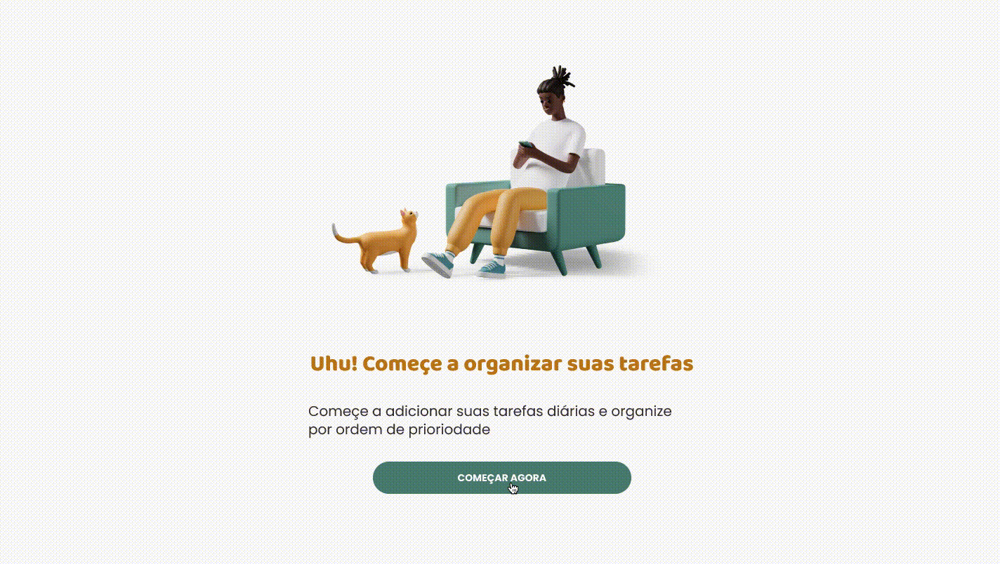

<!-- Título -->
<h1 align="center">
  
  
  <!--  -->
 
<a href="https://www.figma.com/file/SeybL2HtUDI3M0NilPDOjN/Challenge---Todo-List?node-id=103%3A134" target="_blank">FIGMA</a>

</h1>
<!-- /Título -->

<!-- Subtítulo -->
<h4 align="center">
  🎯 Um desafio para alavancar seus conhecimentos em Front-end 🚀
</h4>
<!-- /Subtítulo -->

<!-- Badges -->

 

<!-- /Badges -->

<!-- Menu -->

  <a href="#desafio">Desafio</a> •
  <a href="#requisitos">Requisitos</a> •
  <a href="#tecnologias">Tecnologias</a> •
  <a href="#como-começar">Como começar</a> •
  <a href="#pontuação">Pontuação</a> •
  <a href="#o-que-fazer-após-terminar-o-desafio">Entregar desafio</a>

<!-- /Menu -->

## Desafio

Seu desafio é criar uma aplicação de to do list para organizar as tarefas diária.

## Requisitos

### Funcionais

- Em seu primeiro acesso o usuário deve visualizar a página de "Começar"; 
- O usuário deve conseguir adicionar uma tarefa; 
- O usuário deve conseguir deletar uma tarefa; 
- O usuário deve conseguir completar uma tarefas; 
- O usuário deve conseguir ordenar as tarefas; 
- O usuário só deve conseguir ordenar as tarefas pendentes.

### Não funcionais

- As tarefas devem ser armazenadas no localStorage;
- **Bônus:** Configurar ESLint e Prettier no projeto.
- **Bônus:** Adicionar testes unitários.
- **Bônus:** Adicionar documentação dos componentes;
- **Bônus:** Escreva um README do projeto;

## Tecnologias

Você tem liberdade para utilizar as tecnologias que estiver confortável, mas também deixamos algumas sugestões para você:

- [Next.js](https://nextjs.org/)
- [TypeScript](https://www.typescriptlang.org/)
- [React DnD](https://react-dnd.github.io/react-dnd)
- [Styled Components](https://styled-components.com/)
- [Phosphor Icons](https://phosphoricons.com/)
- [Jest](https://jestjs.io/pt-BR/)
- [Storybook](https://storybook.js.org/)
- [React Testing Library](https://testing-library.com/docs/react-testing-library/intro/)

## Como começar

Nós deixamos livre para que o DEV crie o projeto com as stacks que ele se sinta mais confortável. Então você deve criar um repostório público direto no seu Github.

## Pontuação

- 👷 EM CONSTRUÇÃO ⚠️

## O que fazer após terminar o desafio?

🙈 Não tenha medo de mostrar que você está em evolução, essa é uma grande oportunidade para que as pessoas e empresas te notem nesse processo.

- Abra uma [ISSUE - DESAFIO CONCLUÍDO](https://github.com/DevEmTreinamento/todo-list/issues/new?assignees=KaiqueCovo&labels=Em+Review&template=desafio-conclu-do.md&title=%5BDesafio+Conclu%C3%ADdo%5D+-+SEU_USUARIO_DO_GITHUB) para que outros devs possam olhar seu projeto e dar dicas de melhorias e ajudar você a compartilhar;

---

Made with 💚 by [Dev em treinamento](https://www.devemtreinamento.com.br) 👋
